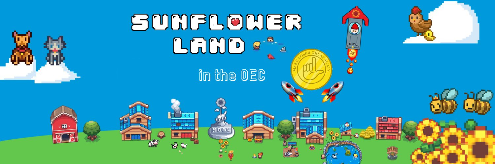

# Loser Land

****


**The information provided on this website does not constitute investment advice, financial advice, trading advice, or any other sort of advice and you should not treat any of the website’s content as such. The Sunflower team does not recommend that any cryptocurrency should be bought, sold, or held by you.**

****

**The game uses a utility token that is not intended for purchase. The game can be played entirely without the need to purchase any token. Always do your research**


### About the game

Loser Land (Sunflower Farmers) is the second chapter of Loser Land, followed by "Prologue: Punk Era" and "Chapter 1：Squid Game". It began as a project for the METAFORCE Hackathon hosted by OEC.&#x20;

Unlike "Punk Era" and "Squid Game" which are developed from beginning by ourselves, "Sunflower Farmers" is forked from [a project](https://github.com/sunflower-land/sunflower-farmers) that deployed on Polygon network, which achieved a big success but finally paused due to bots that crowding into the game.

For now, Loser Land (Sunflower Farmers) just almost the same with the origin version, inheriting the both advantages and flaws. We believe one day bots will enter into Loser Land either. Hope when that day comes we are ready to release the next chapter.

As like the origin version, instead of pre-mining $SFF, I made the decision to launch the game for free for the community to play. No centralised server and the only requirement was a donation to play. We're not doing this for money, nor have we farmed many tokens for now. We can't offer you much to join our community of designers and developers except the chance to realize your ideas for our lovely community. If you have any ideas, welcome to join us.

### How did people earn $SFF?

Sunflower Farmers Token was a utility token to craft in game items and grow your farm. Farms started with 3 sunflowers which could be used organically to gain in-game tokens and upgrade to more valuable crops. No purchase of $SFF was ever needed to play the game.

### The Future of Loser Land

The team is doing the hard work to enhance the game experience and bring more fun for players. Someday we will integrate "Sunflower Farmers" with "Squid Game", where players can keep pets on the farm and fight with other pets on the Squid Game. Our ultimate goal is to explore new form of blockchain game and become the #1 Metaverse platform.

